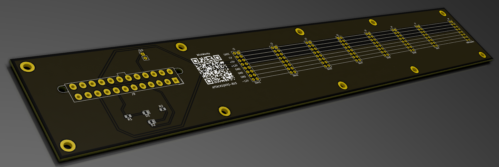

# ATTACKS(ATX)-Bus

This is a board designed to power eurorack applications using an ATX power supply from a PC. I tend to have them laying around, so this seemed a logical use. The bus bar presents 7 devices with power, and the bus bar connects to other bus bars to extent the power to new racks or for more ports in the same rack.

This project was created using kicad, and the project files are included. If that's more involved than you would like to be, also included is a zip file of all of the required files to drop off at the board manufacturer of your choice, and BOM, so that you can order all of the parts you need to build your own.

This design extends one LED as a power indicator, and another LED tied to the "Power Good" signal on the ATX Molex connector, which lets you know that the voltages on the pins are within tolerances built into the power supply. There is also a header that can be jumped to tie the sense wire to ground, enabling the power supply to operate. This was left as a header to give the option to extend these pins to a panel switch. If you are not extending this signal, just tie them together with a jumper.
